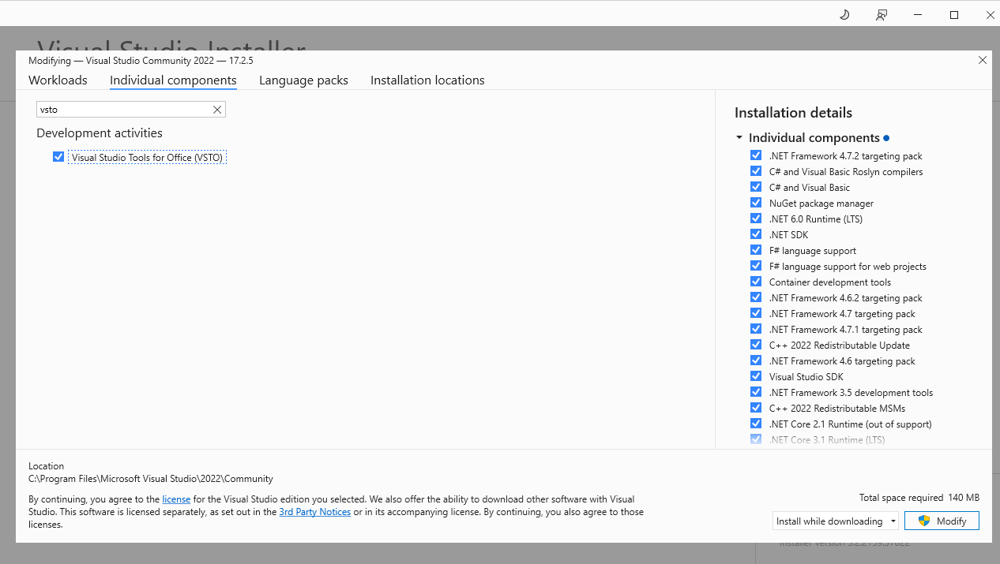
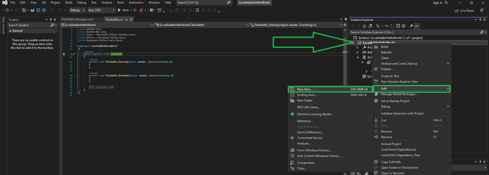
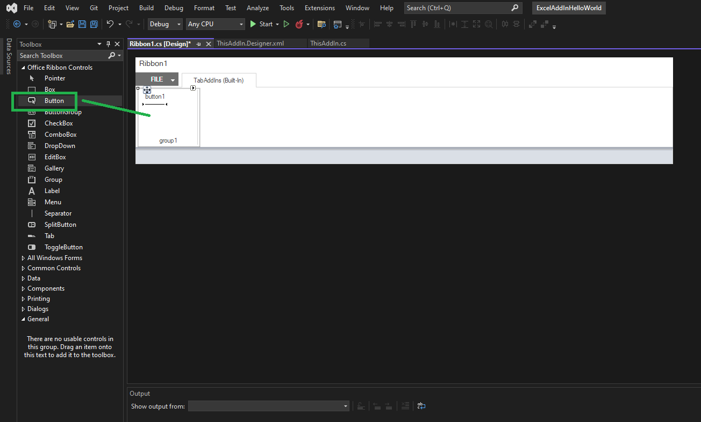

# ExcelAddinHelloWorld  
  
https://docs.microsoft.com/en-us/visualstudio/vsto/walkthrough-creating-your-first-vsto-add-in-for-excel  

Make sure VSTO is installed for Visual Studio 
  

## How to add new Ribbon to addin project  
Project -> Add New Item -> Ribbon (Visual Designer)  
  
.png)  
.png)  

## How to add a new RibbonButton to the Ribbon Ribbon (Visual Designer)  
Open the Ribbon (Visual Designer) object  
Open the controls toolbox  
Expand the Office Ribbon Controls tab  
Drag a Button onto the Ribbon  
  
